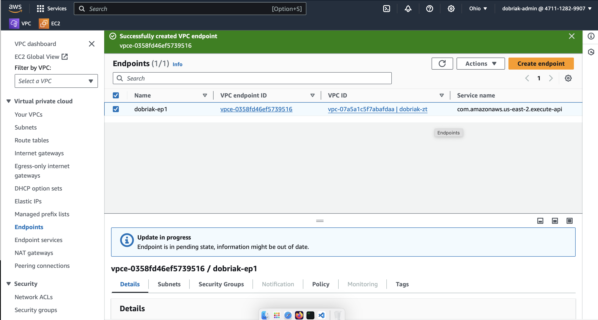
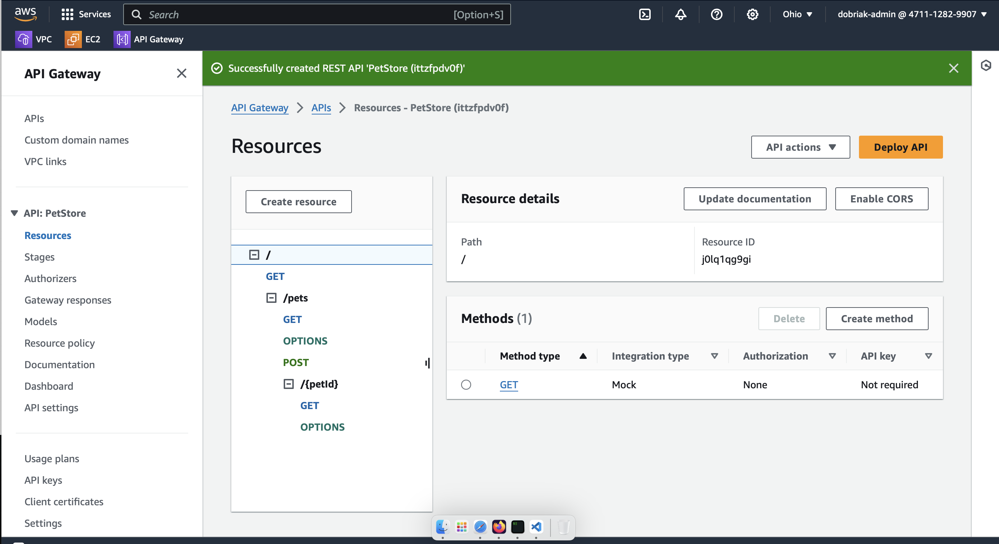
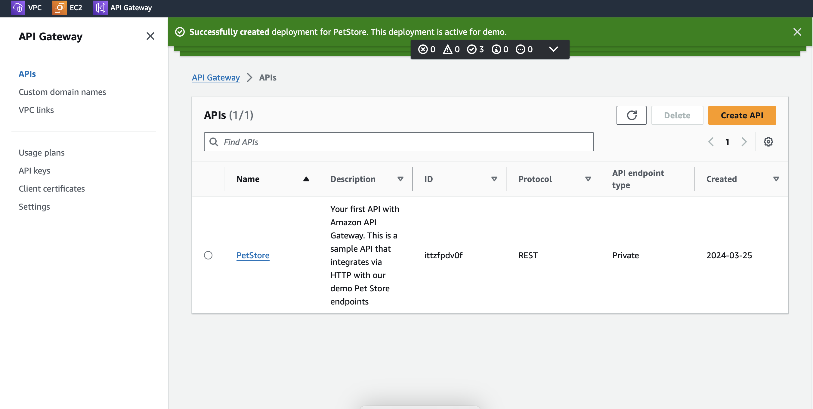
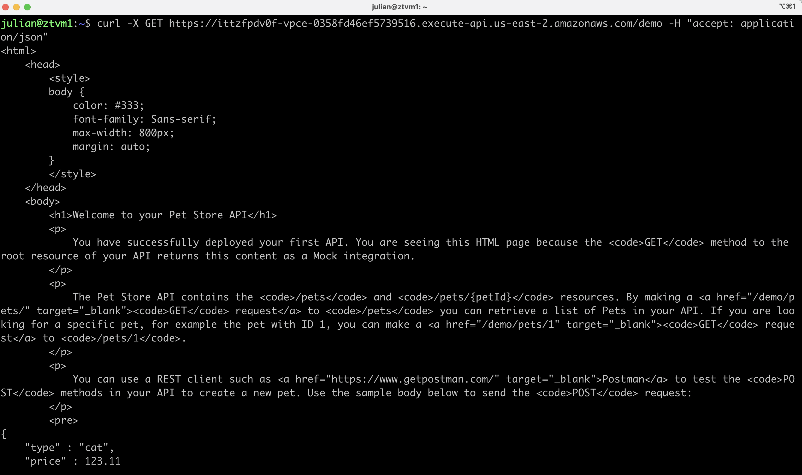

# Netfoundry open ziti exercise

## Steps:
* Created an AWS account
*  Installed and configured AWS cli on my laptop
*  Created NetFoundry teams account

## AWS setup:
*  Wrote a simple script to spin up a VPC with private and public subnets. Internet gateway for the public subnet, NAT gateway for the private. Also security group for the public subnet allowing in tcp 80,443,6262, security group for private subnet allowing traffic from public to private.
* Spun up vms in both subnets and verified both can route to the internet.
```
#!/bin/bash
# VPC
aws ec2 create-vpc --cidr-block 10.0.0.0/16 --tag-specification 'ResourceType=vpc,Tags=[{Key=Name,Value=dobriak-zt}]' > vpc.json
vpc_id=$(cat vpc.json | jq -r '.Vpc.VpcId')
# Subnets
aws ec2 create-subnet --vpc-id $vpc_id --cidr-block 10.0.0.0/20 --tag-specifications 'ResourceType=subnet,Tags=[{Key=Name,Value=zt-public}]' > subnet-public.json
pub_sub_id=$(cat subnet-public.json | jq -r '.Subnet.SubnetId')
aws ec2 create-subnet --vpc-id $vpc_id --cidr-block 10.0.16.0/20 --tag-specifications 'ResourceType=subnet,Tags=[{Key=Name,Value=zt-private}]' > subnet-private.json
priv_sub_id=$(cat subnet-private.json | jq -r '.Subnet.SubnetId')

# IGW
aws ec2 create-internet-gateway --tag-specifications 'ResourceType=internet-gateway,Tags=[{Key=Name,Value=zt-igw}]' > igw.json
igw_id=$(cat igw.json | jq -r '.InternetGateway.InternetGatewayId')
aws ec2 attach-internet-gateway --internet-gateway-id $igw_id --vpc-id $vpc_id

# Route table
aws ec2 create-route-table --vpc-id $vpc_id --tag-specifications 'ResourceType=route-table,Tags=[{Key=Name,Value=zt-rtb}]' > rtb.json
rtb_id=$(cat rtb.json | jq -r '.RouteTable.RouteTableId')
# - Associate with public subnet
aws ec2 associate-route-table --route-table-id $rtb_id --subnet-id $pub_sub_id > rtb_assoc.json
# - Route outbound traffic to IGW
aws ec2 create-route --route-table-id $rtb_id --destination-cidr-block 0.0.0.0/0 --gateway-id $igw_id > route_inet_igw.json

# Elastic IP and public NAT gateway
aws ec2 allocate-address --tag-specifications 'ResourceType=elastic-ip,Tags=[{Key=Name,Value=zt-eip}]' > elasticip.json
eip_ip=$(cat elasticip.json | jq -r '.PublicIp')
eip_id=$(cat elasticip.json | jq -r '.AllocationId')
aws ec2 create-nat-gateway --subnet-id $pub_sub_id --allocation-id $eip_id > nat_gw.json
natgw_id=$(cat nat_gw.json | jq -r '.NatGateway.NatGatewayId')
aws ec2 create-tags --resources $natgw_id --tags 'Key=Name,Value=zt-natgw'

# Get rtb id of private subnet and point outbound traffic to NAT gw
aws ec2 describe-route-tables --filters "Name=vpc-id,Values=$vpc_id" --query="RouteTables[*].RouteTableId" > relevant_rtbs.json
priv_sub_rtb=$(cat relevant_rtbs.json| jq -r '.[] | select(.!="'$rtb_id'")')
aws ec2 create-route --route-table-id $priv_sub_rtb --destination-cidr-block 0.0.0.0/0 --gateway-id $natgw_id > route_inet_natgw.json

# Pem key
aws ec2 create-key-pair --key-name dobriak-kp1  > keypair.json
cat keypair.json| jq -r '.KeyMaterial' > dobriak-kp* pem
chmod 600 dobriak-kp* pem

# Create VMs and SGs in priv/pub subnets
# - Public in ssh,80,443,6262
myip=$(curl https://checkip.amazonaws.com/)
aws ec2 create-security-group --group-name zt-public --description "ZT public security group" --vpc-id $vpc_id > public_sg.json
pub_sg_id=$(cat public_sg.json | jq -r '.GroupId')
for p in 22 80 443 6262; do aws ec2 authorize-security-group-ingress --group-id $pub_sg_id --protocol tcp --port $p --cidr "${myip}/32" > pub_sg_${p}.json ;done
# - Private in All from vpc
aws ec2 create-security-group --group-name zt-private --description "ZT private security group" --vpc-id $vpc_id > private_sg.json
priv_sg_id=$(cat private_sg.json | jq -r '.GroupId')
aws ec2 authorize-security-group-ingress --group-id $priv_sg_id --protocol all --cidr "10.0.0.0/16" > private_sg_rules.json
# - Public VM
aws ec2 run-instances \
    --image-id resolve:ssm:/aws/service/ami-amazon-linux-latest/amzn2-ami-hvm-x86_64-gp2 \
    --instance-type t2.micro \
    --count 1 \
    --key-name dobriak-kp1 \
    --security-group-ids $pub_sg_id \
    --subnet-id $pub_sub_id \
    --associate-public-ip-address > public_instance.json
pub_instance_id=$(cat public_instance.json | jq -r '.Instances[0].InstanceId')
sleep 5m
aws ec2 describe-instances --instance-ids $pub_instance_id > public_instance_detail.json
public_instance_ip=$(cat public_instance_detail.json | jq -r '.Reservations[0].Instances[0].PublicIpAddress')

# - Private VM
aws ec2 run-instances \
    --image-id resolve:ssm:/aws/service/ami-amazon-linux-latest/amzn2-ami-hvm-x86_64-gp2 \
    --instance-type t2.micro \
    --count 1 \
    --key-name dobriak-kp1 \
    --security-group-ids $priv_sg_id \
    --subnet-id $priv_sub_id > private_instance.json
priv_instance_id=$(cat private_instance.json | jq -r '.Instances[0].InstanceId')
sleep 3m
aws ec2 describe-instances --instance-ids $priv_instance_id > private_instance_detail.json
private_instance_ip=$(cat private_instance_detail.json | jq -r '.Reservations[0].Instances[0].PrivateIpAddress')

```

## ZT network setup:
*  Followed the [getting started guide](https://support.netfoundry.io/hc/en-us/articles/4418243181453-Sign-up-for-NetFoundry-console-access-and-create-your-Zero-Trust-Network), to set up my account (`dobriak`)
*  Created endpoint identity on a linux vm running in my home lab (`ztvm1`)
*  Created an [edge router resource](https://support.netfoundry.io/hc/en-us/articles/360016342971-Deployment-Guide-for-AWS-Edge-Routers) in AWS us-east-2
*  Deployed a private endpoint in the private subnet of my VPC

*  Created sample APIs in AWS gateway product


*  Updated the newly created REST api URI to be available only via the zero trust network
```
aws apigateway update-rest-api --rest-api-id 'xxxx' --patch-operations "op='add',path='/endpointConfiguration/vpcEndpointIds',value='vpce-xxxxx'" --region us-east-2
```
*  Re-deployed the API in the same stage

## NetFoundry service and AppWAN
*  Created a service with altered base uri to account for the private endpoint, in my case `dobriak-svc`:
```
https://apixxx-vpcexxxxxxx.execute-api.us-east-2.amazonaws.com/demo
```
*  Created AppWAN that connects the above mentioned service with with my linux vm identity endpoint `ztvm1`
*  From said vm, issued a curl to the sample API uri that went over the zero trust network, through the edge router and hit the sample PetStore application


### Notes:
The only problem I encountered was with the linux vm endpoint, the script that installs the tunnel service relies on modifying /etc/resolv.conf to insert a custom name resolver at the top. This fails in newer distros, so I had to manually edit that file and make it immutable for the purposes of testing.